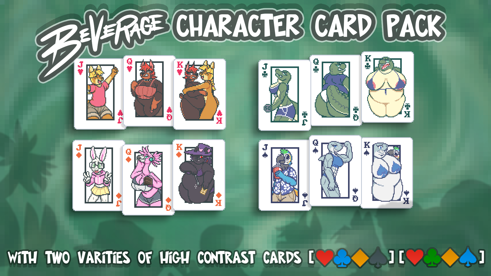

# Beverage's Character Cards!

--- Art by Beverage --- v1.1

A resource pack that changes the 12 face cards of Spades, Hearts, Diamonds, and Clubs to include Beverage's original characters.
Characters include 
Sundrop (Jack & King of Hearts), 
Pepsi (Queen & King of Hearts), 
Cheerwine (Jack, Queen, and King of Clubs), 
RC Cola (Queen and King of Spades), 
Piña Colada (Jack of Spades), 
Beverage (Jack of Diamonds), 
Pink Lemonade (Queen of Diamonds), 
Fanta (King of Diamonds).

# Colorful High Contrast Cards

The pack's default High Contrast cards are the same colors as Balatro's (Red Heart, Yellow Diamond, Blue Clubs, Purple Spades), but the pack also includes an alternate set of High Contrast cards (Green Clubs, Blue Spades) which offers a more colorful alternative.
It loses some of the contrast that is intended to help those who are colorblind, but it's personally helped me (someone without colorblindness) more than the default high contrast.

To activate it, it requires changing the filenames of the texture files.

...\mods\Beverage Character Pack\assets\1x\Beverage_Cards_hc_alt.png

...\mods\Beverage Character Pack\assets\2x\Beverage_Cards_hc_alt.png

# Download Instructions:

Requires Steammodded and Lovely.

Download and extract folder.

Copy the BeverageCharacterPack folder to %AppData%\Balatro\Mods\

 

